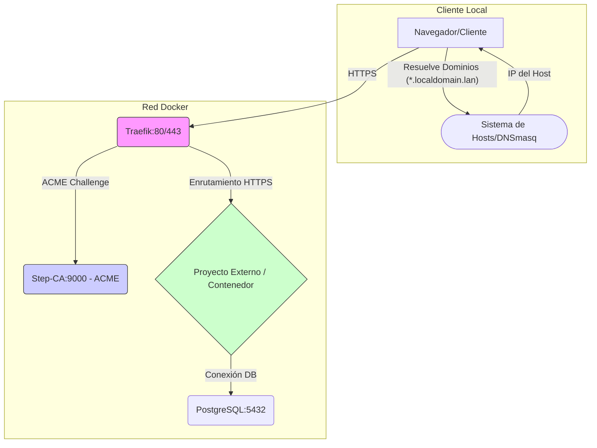

[English 🇬🇧](README.md)

# 🌐 traefik-stepca-base: Infraestructura de Servicios Locales Seguros (Stack Base)

**Descripción:** Infraestructura Docker Compose base para entornos de desarrollo local con HTTPS/TLS de confianza. Utiliza **Traefik** como proxy inverso y **Step-CA** como Autoridad de Certificación local, permitiendo que múltiples proyectos desacoplados obtengan certificados de confianza (*trusted*) automáticamente.

**Licencia:** Licencia MIT

---

## 🚀 Gestión de Comandos con Just

Esta infraestructura utiliza **Just** para centralizar y simplificar la ejecución de comandos, actuando como una potente alternativa a `make`.

* **Instalación:** Consulta la [Documentación Oficial de Just](https://github.com/casey/just).
* **Uso:** En lugar de `make comando`, simplemente usas `just comando`.
* **Ver Comandos:** Ejecuta `just` sin argumentos para ver la lista de todos los comandos disponibles en el `justfile`.

---

## 🛠️ Requisitos

Asegúrate de tener instaladas las siguientes herramientas en tu sistema:

* **Docker** y **Docker Compose**
* **Just** (El ejecutor de comandos: `cargo install just`)
* **Bash**, **jq**, **uuidgen**, **openssl**
* **dnsmasq** (Opcional, pero muy recomendado para dominios locales)

---

## 🚀 Proceso de Configuración Inicial (Setup)

El comando **`just setup`** ejecuta todas las tareas de inicialización necesarias para dejar la infraestructura base lista y operativa.

```bash
just setup
```

### 1\. Configuración de Hosts o DNS (Obligatorio)

Para que **Traefik** pueda enrutar correctamente los dominios (`*.localdomain.lan`), debes configurar tu sistema para que resuelva estos nombres a la **IP del host** donde se ejecuta el stack base.

  * **Entornos de un solo desarrollador (local):** Resuelve a **`127.0.0.1`**.
  * **Entornos de desarrollo compartidos:** Los clientes deben resolver a la **IP real del servidor** que ejecuta el stack base.

#### Opción A: Modificación Directa de `/etc/hosts`

Edita el archivo `/etc/hosts` y añade las entradas de los dominios definidos en tu `.env`. Sustituye `127.0.0.1` por la IP correcta si trabajas en un entorno compartido:

```bash
# Entradas generadas por la infraestructura local
127.0.0.1 arcane.localdomain.lan
127.0.0.1 tasks.localdomain.lan
...
```

#### Opción B: Uso de dnsmasq (Recomendado para Comodines)

Para manejar fácilmente cualquier subdominio de `.localdomain.lan` sin modificar constantemente `/etc/hosts`:

1.  **Crear el archivo de configuración** (p.ej., `/etc/dnsmasq.d/dev-domains.conf`):

    ```conf
    # Resuelve cualquier subdominio de .localdomain.lan a 127.0.0.1 (o IP del servidor)
    address=/.localdomain.lan/127.0.0.1
    ```

2.  Configura tu sistema para usar `127.0.0.1` como servidor DNS primario y **reinicia `dnsmasq`**.

### 2\. Confianza del Certificado Raíz de Step-CA (Paso Clave)

Para evitar las advertencias de seguridad en el navegador ("Certificado no válido"), debes añadir la **Autoridad de Certificación Raíz (CA)** de **Step-CA** al almacén de confianza de tu sistema operativo. El archivo que necesitas es **`step/certs/root_ca.crt`**, generado durante `just init-stepca`.

#### 🍏 macOS (Acceso a Llaveros)

1.  Abre **Acceso a Llaveros** (Keychain Access).
2.  Ve a `Archivo` -\> `Importar ítems...` y selecciona **`step/certs/root_ca.crt`**.
3.  Busca el certificado **"Local Development CA"**.
4.  Doble clic en él. En la sección **Confiar** (Trust), cambia el campo **Al usar este certificado** a **Confiar siempre** (`Always Trust`).
5.  Cierra y **reinicia tu navegador**.

#### 🐧 Linux (Debian/Ubuntu)

1.  Copia el certificado:
    ```bash
    sudo cp step/certs/root_ca.crt /usr/local/share/ca-certificates/step_ca.crt
    ```
2.  Actualiza el almacén de certificados:
    ```bash
    sudo update-ca-certificates
    ```
3.  Reinicia el navegador.

#### 💻 Windows

1.  Doble clic en **`step/certs/root_ca.crt`**.
2.  Haz clic en **Instalar certificado...**.
3.  Selecciona **Máquina local**.
4.  Selecciona **Colocar todos los certificados en el siguiente almacén** y haz clic en **Examinar**.
5.  Selecciona **Autoridades de certificación raíz de confianza** (`Trusted Root Certification Authorities`).
6.  Finaliza la instalación y **reinicia tu navegador**.

-----

## ⚙️ Estructura de la Infraestructura

### Resumen de Servicios del Stack Base

| Servicio       | Imagen Base          | Función                                            | Acceso                                           |
| :------------- | :------------------- | :------------------------------------------------- | :----------------------------------------------- |
| **traefik**    | (Custom build)       | Proxy Inverso / Balanceador de Carga / ACME Client | `http://localhost:$TRAEFIK_API_PORT` (Dashboard) |
| **step-ca**    | `smallstep/step-ca`  | Autoridad de Certificación Local (ACME Server)     | Interno                                          |
| **postgresql** | `postgres:16-alpine` | Base de Datos Compartida                           | Interno (Usado por proyectos)                    |
| **Red**        | `common_app_network` | Red Bridge compartida con Proyectos Externos       | N/A                                              |

### 🖼️ Diagrama de Infraestructura Base



-----

## 🚀 Modelo de Desarrollo Desacoplado

Las aplicaciones de desarrollo deben ejecutarse como **proyectos externos e independientes** en sus propios directorios. Solo necesitan conectarse a la red compartida **`common_app_network`** para ser detectados por Traefik.

### ➕ Ejemplo: Conectar un Proyecto WordPress

Para integrar un proyecto WordPress (`wordpress_dev`) y exponerlo en `https://blog.localdomain.lan`:

#### 1\. Definir la Red Externa

En el `docker-compose.yml` de tu proyecto WordPress, declara la red base como externa:

```yaml
# En el directorio del proyecto WordPress: ~/dev/my-wp-project/docker-compose.yml

networks:
  base_network:
    external: true
    name: common_app_network # ¡Importante! Debe coincidir con el nombre de la red base.
```

#### 2\. Configurar el Servicio WordPress

Define el servicio, conectándolo a la red compartida y añadiendo las **etiquetas de Traefik** necesarias:

```yaml
services:
  wordpress_dev:
    image: wordpress:latest
    container_name: WordPress_Dev
    restart: "no"
    volumes:
      - ./wp-content:/var/www/html/wp-content
    environment:
      # Conexión a la BD PostgreSQL del stack base
      WORDPRESS_DB_HOST: postgresql:5432 # Usando el nombre del servicio 'postgresql'
      WORDPRESS_DB_NAME: wp_db
      WORDPRESS_DB_USER: ${POSTGRES_USER} # Variables del .env base
      WORDPRESS_DB_PASSWORD: ${POSTGRES_PASSWORD}
      # URL canónica para WordPress
      WORDPRESS_CONFIG_EXTRA: |
        define('WP_HOME', 'https://${WP_DOMAIN}');
        define('WP_SITEURL', 'https://${WP_DOMAIN}');
    labels:
      "traefik.enable=true"
      "traefik.http.routers.wordpress.rule=Host(`${WP_DOMAIN}`)" # Usamos la variable del .env
      "traefik.http.routers.wordpress.entrypoints=websecure"
      "traefik.http.routers.wordpress.tls.certresolver=step"
      "traefik.http.services.wordpress.loadbalancer.server.port=80" # Puerto interno de WordPress
    networks:
      - base_network
```

#### 3\. Definir Variables de Entorno

Asegúrate de que el dominio esté definido en tu `.env` (o en un archivo `.env` específico de WordPress):

```bash
# Variables de Dominio (en tu .env base o el del proyecto)
WP_DOMAIN=blog.localdomain.lan
```

#### 4\. Levantar el Proyecto

Desde el directorio del proyecto WordPress, inicia el stack. **Solo** se iniciará el contenedor de WordPress:

```bash
docker compose up -d
```

Traefik detectará automáticamente el nuevo servicio, solicitará el certificado y el blog estará accesible en `https://blog.localdomain.lan`.

-----

## 📖 Comandos Útiles de Just (Stack Base)

| Comando          | Descripción                                                                          |
| :--------------- | :----------------------------------------------------------------------------------- |
| **`just setup`** | **Comando principal.** Realiza el setup completo (deps, .env, Step-CA, arranque).    |
| `just up`        | Inicia todos los contenedores del stack base en modo *detached*.                     |
| `just down`      | Detiene y elimina todos los contenedores, redes y volúmenes anónimos del stack base. |
| `just build`     | Construye la imagen de Traefik.                                                      |
| `just restart`   | Ejecuta `down`, `build` y `up`.                                                      |
| `just show-info` | Muestra las URLs de acceso y la configuración de `hosts` necesaria.                  |
| `just init-env`  | Inicializa o actualiza el archivo `.env` con variables y contraseñas seguras.        |
