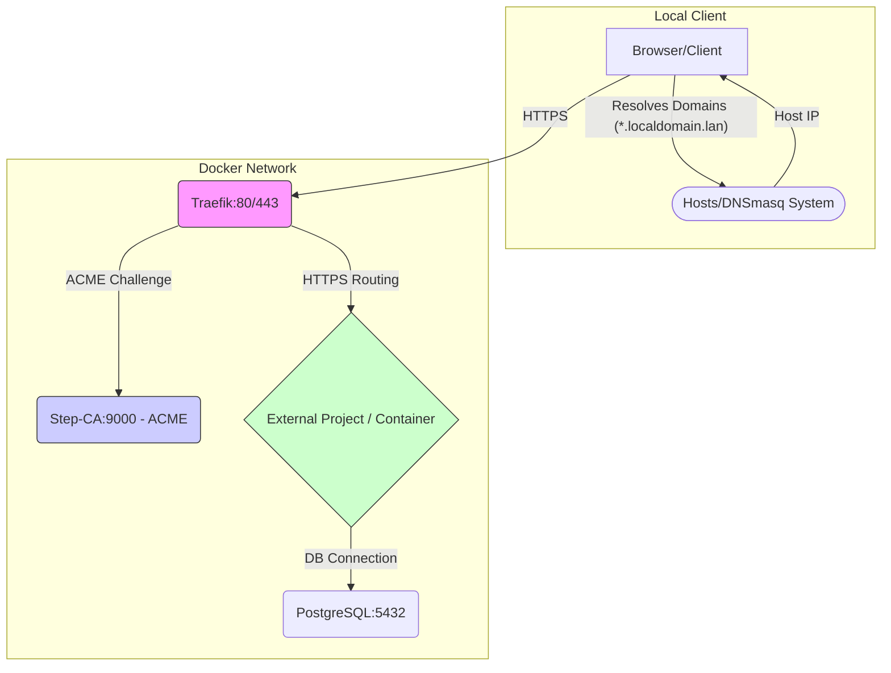

[Español 🇪🇸](README.es.md)

# 🌐 traefik-stepca-base: Secure Local Development Stack

**Description:** Base Docker Compose infrastructure for local development environments with trusted HTTPS/TLS. It uses **Traefik** as the reverse proxy and **Step-CA** as the local Certificate Authority, allowing multiple decoupled projects to automatically obtain trusted certificates.

**License:** MIT License

---

## 🚀 Command Management with Just

This infrastructure uses **Just** to centralize and simplify command execution, serving as a powerful alternative to `make`.

* **Installation:** See the [Official Just Documentation](https://github.com/casey/just).
* **Usage:** Instead of `make command`, you use `just command`.
* **View Commands:** Execute `just` without arguments to see the list of all available commands in the `justfile`.

---

## 🛠️ Requirements

Ensure you have the following tools installed on your system:

* **Docker** and **Docker Compose**
* **Just** (The command runner: `cargo install just`)
* **Bash**, **jq**, **uuidgen**, **openssl**
* **dnsmasq** (Optional, but highly recommended for local domains)

---

## 🚀 Initial Configuration Process (Setup)

The **`just setup`** command executes all necessary initialization tasks to get the base infrastructure up and running.

```bash
just setup
```

### 1\. Host or DNS Configuration (Mandatory)

For **Traefik** to correctly route domains (`*.localdomain.lan`), you must configure your system to resolve these names to the **host IP** where the base stack is running.

  * **Single-developer environments (local):** Resolve to **`127.0.0.1`**.
  * **Shared development environments:** Clients must resolve to the **server's actual IP** running the base stack.

#### Option A: Direct Modification of `/etc/hosts`

Edit the `/etc/hosts` file and add the domain entries defined in your `.env`. Replace `127.0.0.1` with the correct IP if working in a shared environment:

```bash
# Entries generated by the local infrastructure
127.0.0.1 arcane.localdomain.lan
127.00.1 tasks.localdomain.lan
...

```

#### Option B: Using dnsmasq (Recommended for Wildcards)

To easily manage any subdomain of `.localdomain.lan` without constantly modifying `/etc/hosts`:

1.  **Create the configuration file** (e.g., `/etc/dnsmasq.d/dev-domains.conf`):

    ```conf
    # Resolves any subdomain of .localdomain.lan to 127.0.0.1 (or server IP)
    address=/.localdomain.lan/127.0.0.1
    ```

2.  Configure your system to use `127.0.0.1` as the primary DNS server and **restart `dnsmasq`**.

### 2\. Step-CA Root Certificate Trust (Key Step)

To avoid security warnings in the browser ("Invalid Certificate"), you must add the **Step-CA Root Certificate Authority (CA)** to your operating system's trust store. The file you need is **`step/certs/root_ca.crt`**, generated during `just init-stepca`.

#### 🍏 macOS (Keychain Access)

1.  Open **Keychain Access**.
2.  Go to `File` -\> `Import Items...` and select **`step/certs/root_ca.crt`**.
3.  Search for the certificate **"Local Development CA"**.
4.  Double-click it. In the **Trust** section, change the **When using this certificate** field to **Always Trust**.
5.  Close and **restart your browser**.

#### 🐧 Linux (Debian/Ubuntu)

1.  Copy the certificate:
    ```bash
    sudo cp step/certs/root_ca.crt /usr/local/share/ca-certificates/step_ca.crt
    ```
2.  Update the certificate store:
    ```bash
    sudo update-ca-certificates
    ```
3.  Restart the browser.

#### 💻 Windows

1.  Double-click on **`step/certs/root_ca.crt`**.
2.  Click **Install Certificate...**.
3.  Select **Local Machine**.
4.  Select **Place all certificates in the following store** and click **Browse**.
5.  Select **Trusted Root Certification Authorities**.
6.  Finish the installation and **restart your browser**.

-----

## ⚙️ Infrastructure Structure

### Base Stack Services Summary

| Service        | Base Image           | Function                                    | Access                                           |
| :------------- | :------------------- | :------------------------------------------ | :----------------------------------------------- |
| **traefik**    | (Custom build)       | Reverse Proxy / Load Balancer / ACME Client | `http://localhost:$TRAEFIK_API_PORT` (Dashboard) |
| **step-ca**    | `smallstep/step-ca`  | Local Certificate Authority (ACME Server)   | Internal                                         |
| **postgresql** | `postgres:16-alpine` | Shared Database                             | Internal (Used by projects)                      |
| **Network**    | `common_app_network` | Shared Bridge Network for External Projects | N/A                                              |

### 🖼️ Base Infrastructure Diagram



-----

## 🚀 Decoupled Development Model

Development applications must be run as **external and independent projects** in their own directories. They must connect to the shared **`common_app_network`** to be detected by Traefik.

### ➕ Example: Connecting a WordPress Project

To integrate a WordPress project (`wordpress_dev`) and expose it at `https://blog.localdomain.lan`:

#### 1\. Define the External Network

In your WordPress project's `docker-compose.yml`, declare the base network as external:

```yaml
# In the WordPress project directory: ~/dev/my-wp-project/docker-compose.yml

networks:
  base_network:
    external: true
    name: common_app_network # Must match the name of the base stack network!
```

#### 2\. Configure the WordPress Service

Define the service, connecting it to the shared network and adding the necessary **Traefik labels**:

```yaml
services:
  wordpress_dev:
    image: wordpress:latest
    container_name: WordPress_Dev
    restart: "no"
    volumes:
      - ./wp-content:/var/www/html/wp-content
    environment:
      # Connection to the PostgreSQL DB from the base stack
      WORDPRESS_DB_HOST: postgresql:5432 # Using the service name 'postgresql'
      WORDPRESS_DB_NAME: wp_db
      WORDPRESS_DB_USER: ${POSTGRES_USER} # Variables from the base .env
      WORDPRESS_DB_PASSWORD: ${POSTGRES_PASSWORD}
      # Canonical URL for WordPress
      WORDPRESS_CONFIG_EXTRA: |
        define('WP_HOME', 'https://${WP_DOMAIN}');
        define('WP_SITEURL', 'https://${WP_DOMAIN}');
    labels:
      "traefik.enable=true"
      "traefik.http.routers.wordpress.rule=Host(`${WP_DOMAIN}`)" # Using the .env variable
      "traefik.http.routers.wordpress.entrypoints=websecure"
      "traefik.http.routers.wordpress.tls.certresolver=step"
      "traefik.http.services.wordpress.loadbalancer.server.port=80" # Internal WordPress port
    networks:
      - base_network
```

#### 3\. Define Environment Variables

Ensure the domain is defined in your `.env` (or a WordPress-specific `.env` file):

```bash
# Domain Variables (in your base .env or project .env)
WP_DOMAIN=blog.localdomain.lan
```

#### 4\. Bring Up the Project

From the WordPress project directory, start the stack. **Only** the WordPress container will start:

```bash
docker compose up -d
```

Traefik will automatically detect the new service, request the certificate, and the blog will be accessible at `https://blog.localdomain.lan`.

-----

## 📖 Useful Just Commands (Base Stack)

| Command          | Description                                                                          |
| :--------------- | :----------------------------------------------------------------------------------- |
| **`just setup`** | **Main command.** Performs the complete setup (deps, .env, Step-CA, startup).        |
| `just up`        | Starts all base stack containers in detached mode.                                   |
| `just down`      | Stops and removes all containers, networks, and anonymous volumes of the base stack. |
| `just build`     | Builds the Traefik image.                                                            |
| `just restart`   | Runs `down`, `build`, and `up`.                                                      |
| `just show-info` | Shows access URLs and necessary `hosts` configuration.                               |
| `just init-env`  | Initializes or updates the `.env` file with secure variables and passwords.          |
